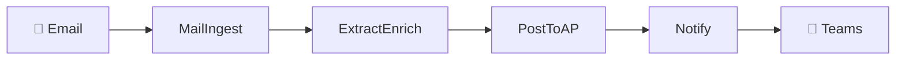

# Invoice Agent 📧➡️💰

Automated invoice processing system built with Azure Functions that transforms email attachments into enriched, routed invoices in under 60 seconds.

## 🎯 Overview

The Invoice Agent automates the tedious manual process of routing invoices from email to accounts payable. It monitors a shared mailbox, extracts vendor information, enriches with GL codes, and routes to the appropriate department - all while maintaining a complete audit trail.

**Current State:** Manual processing takes 5+ minutes per invoice
**Target State:** Automated processing in <60 seconds

## 🚀 Quick Start

### Prerequisites
- Python 3.11+
- Docker Desktop
- Azure Functions Core Tools v4 (optional, for running functions)

### Local Development Setup

**One-command setup:**
```bash
# Clone and setup
git clone https://github.com/your-org/invoice-agent.git
cd invoice-agent
./scripts/setup-local.sh

# Start developing
source src/venv/bin/activate
make run
```

**Or use Make commands:**
```bash
make setup          # Initial environment setup
make run            # Start functions locally
make test           # Run tests with coverage
make lint           # Check code quality
```

See [Local Development Guide](docs/LOCAL_DEVELOPMENT.md) for detailed instructions.

### Deploy to Azure

```bash
# Use the init command to set up infrastructure
/init

# Build the functions
/build

# Run tests
/test

# Deploy to production
/deploy prod
```

## 📁 Project Structure

```
invoice-agent/
├── .claude/              # AI automation tools
│   ├── agents/          # Code generation agents
│   ├── commands/        # Slash commands
│   ├── CLAUDE.md        # AI instructions
│   └── SPEC.md          # System specification
├── docs/                # Documentation
│   ├── ARCHITECTURE.md  # System design
│   ├── DECISIONS.md     # ADRs
│   ├── ROADMAP.md       # Product roadmap
│   └── CHANGE-LOG.md    # Version history
├── infrastructure/       # Azure deployment
│   ├── bicep/           # IaC templates
│   ├── parameters/      # Environment configs
│   └── scripts/         # Deployment scripts
├── src/                 # Source code
│   ├── functions/       # Azure Functions
│   ├── shared/          # Shared utilities
│   ├── host.json        # Function App config
│   └── requirements.txt # Python dependencies
├── tests/               # Test suite
│   ├── unit/           # Unit tests
│   ├── integration/    # Integration tests
│   └── fixtures/       # Test data
└── data/               # Seed data
    └── vendors.csv     # Vendor master list
```

## 🔄 How It Works

1. **Email Monitoring** - Timer trigger polls shared mailbox every 5 minutes
2. **Vendor Extraction** - Identifies vendor from email sender/subject
3. **Data Enrichment** - Looks up GL codes and department allocation
4. **AP Routing** - Sends enriched invoice to accounts payable
5. **Notifications** - Posts status to Teams channel



## 🛠️ Current Features (MVP - Deployed Nov 14, 2024)

### Deployed to Production ✅
- ✅ Full CI/CD pipeline with staging/production slot pattern
- ✅ Infrastructure deployed (Function App, Storage, Key Vault, App Insights)
- ✅ 5 Azure Functions implemented and tested (98 tests, 96% coverage)
- ✅ Comprehensive monitoring and logging
- ✅ Managed Identity-based authentication (no secrets in code)

### Ready for Activation (Functions Deployed, Awaiting Vendor Data)
- 🟡 **Automated email processing** (5min polling) - Function deployed, requires VendorMaster data
- 🟡 **Vendor lookup and enrichment** - Function deployed, VendorMaster table empty
- 🟡 **GL code application** - Ready when vendor data available
- 🟡 **AP email routing** - Ready when vendor data available
- 🟡 **Teams notifications** - Configured and tested
- 🟡 **Transaction audit log** - ULID-based tracking ready
- 🟡 **Unknown vendor handling** - Ready
- 🟡 **HTTP vendor management endpoint** - Deployed and functional

**Next Steps to Activate:**
1. Seed VendorMaster table: `python infrastructure/scripts/seed_vendors.py --env prod`
2. Send test invoice email
3. Monitor end-to-end processing
4. Measure actual performance metrics

## 📊 Quality Metrics (Current Status)

| Metric | Target | Status |
|--------|--------|--------|
| Test Coverage | 60%+ | **96%** ✅ |
| Tests Passing | 100% | **98/98** ✅ |
| CI/CD Pipeline | Stable | **Passing** ✅ |
| Code Quality | ✅ | Black/Flake8/mypy **Passing** ✅ |
| Infrastructure | Deployed | **Production Ready** ✅ |
| Deployment Pattern | Blue/Green | **Staging Slot** ✅ |

**Performance Metrics (Not Yet Tested in Production):**
| Metric | Target | Status |
|--------|--------|--------|
| Processing Time | <60s | *Pending vendor data* |
| Auto-routing Rate | >80% | *Pending vendor data* |
| Unknown Vendors | <10% | *Pending vendor data* |
| Error Rate | <1% | *Pending vendor data* |

## 📋 Planned Features (Phase 2+)

**Not Yet Built** - Future enhancements planned for upcoming phases:

- 🔜 **PDF Text Extraction** - OCR/Form Recognizer integration for invoice documents
- 🔜 **AI Vendor Matching** - Fuzzy matching for unknown vendors using Azure OpenAI
- 🔜 **Duplicate Detection** - Prevent duplicate invoice processing
- 🔜 **NetSuite Direct Integration** - Skip email approval workflow, post directly to NetSuite API
- 🔜 **Multi-Mailbox Support** - Process from multiple shared mailboxes
- 🔜 **Analytics Dashboard** - Power BI reporting on invoice processing metrics

See [ROADMAP.md](docs/ROADMAP.md) for detailed phase planning.

## 🔧 Development Commands

The project includes AI-powered automation commands:

- `/init` - Initialize Azure infrastructure
- `/build` - Generate function code
- `/test` - Run test suite
- `/deploy` - Deploy to Azure
- `/status` - Check system health

## 🧪 Testing

```bash
# Run all tests (pytest.ini configures PYTHONPATH automatically)
pytest

# Run with coverage report
pytest --cov=functions --cov=shared --cov-report=html

# Run specific test file
pytest tests/unit/test_models.py -v

# Run integration tests (requires Azurite)
pytest tests/integration -m integration

# Current test results:
# ✅ 98 tests passing
# ✅ 96% code coverage
# ✅ All critical paths tested
```

## 📝 Configuration

### Environment Variables
- `GRAPH_TENANT_ID` - Azure AD tenant
- `GRAPH_CLIENT_ID` - App registration ID
- `GRAPH_CLIENT_SECRET` - App secret
- `AP_EMAIL_ADDRESS` - Accounts payable mailbox
- `TEAMS_WEBHOOK_URL` - Teams channel webhook

### Key Vault Secrets
All sensitive configuration is stored in Azure Key Vault and accessed via Managed Identity.

## 🚨 Monitoring & Alerts

- Application Insights dashboard
- Queue depth monitoring
- Error rate alerts
- SLO tracking (>80% automation)
- Daily summary reports

## 📖 Documentation

- [Architecture](docs/ARCHITECTURE.md) - System design and components
- [Decisions](docs/DECISIONS.md) - Architectural decision records
- [Roadmap](docs/ROADMAP.md) - Product vision and phases
- [API Spec](.claude/SPEC.md) - Technical specification

## 🤝 Contributing

1. Create feature branch from `main`
2. Follow 25-line function limit
3. Add tests (60% coverage minimum)
4. Update documentation
5. Submit PR with description

## 👥 Team

- **Stakeholders:** Finance, Accounts Payable
- **Support:** IT Operations

## 🆘 Support

For issues or questions:
- Create GitHub issue
- Teams: #invoice-automation

---

**Status:** 🟢 Production Deployed (Functions Active, Awaiting Vendor Data) | **Version:** 1.0.0-MVP | **Last Updated:** 2024-11-14