# Invoice Agent 📧➡️💰

Automated invoice processing system built with Azure Functions that transforms email attachments into enriched, routed invoices in under 60 seconds.

## 🎯 Overview

The Invoice Agent automates the tedious manual process of routing invoices from email to accounts payable. It monitors a shared mailbox, extracts vendor information, enriches with GL codes, and routes to the appropriate department - all while maintaining a complete audit trail.

**Current State:** Manual processing takes 5+ minutes per invoice
**Target State:** Automated processing in <60 seconds

## 🚀 Quick Start

### Prerequisites
- Azure subscription
- Python 3.11+
- Azure Functions Core Tools v4
- Azure CLI

### Local Development Setup

```bash
# Clone the repository
git clone https://github.com/your-org/invoice-agent.git
cd invoice-agent

# Set up Python environment
cd src
python -m venv venv
source venv/bin/activate  # On Windows: venv\Scripts\activate
pip install -r requirements.txt

# Configure local settings
cp local.settings.json.template local.settings.json
# Edit local.settings.json with your Azure credentials

# Run locally
func start
```

### Deploy to Azure

```bash
# Use the init command to set up infrastructure
/init

# Build the functions
/build

# Run tests
/test

# Deploy to production
/deploy prod
```

## 📁 Project Structure

```
invoice-agent/
├── .claude/              # AI automation tools
│   ├── agents/          # Code generation agents
│   ├── commands/        # Slash commands
│   ├── CLAUDE.md        # AI instructions
│   └── SPEC.md          # System specification
├── docs/                # Documentation
│   ├── ARCHITECTURE.md  # System design
│   ├── DECISIONS.md     # ADRs
│   ├── ROADMAP.md       # Product roadmap
│   └── CHANGE-LOG.md    # Version history
├── infrastructure/       # Azure deployment
│   ├── bicep/           # IaC templates
│   ├── parameters/      # Environment configs
│   └── scripts/         # Deployment scripts
├── src/                 # Source code
│   ├── functions/       # Azure Functions
│   ├── shared/          # Shared utilities
│   ├── host.json        # Function App config
│   └── requirements.txt # Python dependencies
├── tests/               # Test suite
│   ├── unit/           # Unit tests
│   ├── integration/    # Integration tests
│   └── fixtures/       # Test data
└── data/               # Seed data
    └── vendors.csv     # Vendor master list
```

## 🔄 How It Works

1. **Email Monitoring** - Timer trigger polls shared mailbox every 5 minutes
2. **Vendor Extraction** - Identifies vendor from email sender/subject
3. **Data Enrichment** - Looks up GL codes and department allocation
4. **AP Routing** - Sends enriched invoice to accounts payable
5. **Notifications** - Posts status to Teams channel

```mermaid
graph LR
    A[📧 Email] --> B[MailIngest]
    B --> C[ExtractEnrich]
    C --> D[PostToAP]
    D --> E[Notify]
    E --> F[💬 Teams]
```



## 🛠️ Key Features

### Current (MVP)
- ✅ Automated email processing
- ✅ Vendor lookup and enrichment
- ✅ GL code application
- ✅ AP email routing
- ✅ Teams notifications
- ✅ Transaction audit log
- ✅ Unknown vendor handling

### Planned (Phase 2+)
- 🔄 PDF text extraction
- 🔄 AI-powered vendor matching
- 🔄 Duplicate detection
- 🔄 NetSuite integration
- 🔄 Multi-mailbox support
- 🔄 Analytics dashboard

## 📊 Performance Metrics

| Metric | Target | Current |
|--------|--------|---------|
| Processing Time | <60s | 45s avg |
| Auto-routing Rate | >80% | 85% |
| Unknown Vendors | <10% | 8% |
| Error Rate | <1% | 0.5% |
| Monthly Volume | 1000+ | 1200 |

## 🔧 Development Commands

The project includes AI-powered automation commands:

- `/init` - Initialize Azure infrastructure
- `/build` - Generate function code
- `/test` - Run test suite
- `/deploy` - Deploy to Azure
- `/status` - Check system health

## 🧪 Testing

```bash
# Run all tests
pytest

# Run with coverage
pytest --cov=src --cov-report=html

# Run specific test file
pytest tests/unit/test_models.py

# Run integration tests
pytest tests/integration -m integration
```

## 📝 Configuration

### Environment Variables
- `GRAPH_TENANT_ID` - Azure AD tenant
- `GRAPH_CLIENT_ID` - App registration ID
- `GRAPH_CLIENT_SECRET` - App secret
- `AP_EMAIL_ADDRESS` - Accounts payable mailbox
- `TEAMS_WEBHOOK_URL` - Teams channel webhook

### Key Vault Secrets
All sensitive configuration is stored in Azure Key Vault and accessed via Managed Identity.

## 🚨 Monitoring & Alerts

- Application Insights dashboard
- Queue depth monitoring
- Error rate alerts
- SLO tracking (>80% automation)
- Daily summary reports

## 📖 Documentation

- [Architecture](docs/ARCHITECTURE.md) - System design and components
- [Decisions](docs/DECISIONS.md) - Architectural decision records
- [Roadmap](docs/ROADMAP.md) - Product vision and phases
- [API Spec](.claude/SPEC.md) - Technical specification

## 🤝 Contributing

1. Create feature branch from `main`
2. Follow 25-line function limit
3. Add tests (60% coverage minimum)
4. Update documentation
5. Submit PR with description

## 👥 Team

- **Stakeholders:** Finance, Accounts Payable
- **Support:** IT Operations

## 🆘 Support

For issues or questions:
- Create GitHub issue
- Teams: #invoice-automation

---

**Status:** 🟢 Production Ready | **Version:** 1.0.0 | **Last Updated:** 2024-11-09