# Invoice Agent - Architecture Diagram

## Complete System Flow

```mermaid
graph TB
    %% External Systems
    SharedMailbox[("📧 Shared Mailbox<br/>invoices@company.com")]
    APTeam[("📬 AP Team Email<br/>ap@company.com")]
    TeamsChannel[("💬 Teams Channel<br/>Notifications")]

    %% Azure Functions
    MailIngest["⏰ MailIngest<br/>(Timer: Every 5 min)"]
    ExtractEnrich["🔍 ExtractEnrich<br/>(Queue Trigger)"]
    PostToAP["📤 PostToAP<br/>(Queue Trigger)"]
    Notify["🔔 Notify<br/>(Queue Trigger)"]
    AddVendor["➕ AddVendor<br/>(HTTP Trigger)"]

    %% Storage
    BlobStorage[("📦 Blob Storage<br/>invoice-attachments")]
    VendorMaster[("📊 Table Storage<br/>VendorMaster")]
    Transactions[("📝 Table Storage<br/>InvoiceTransactions")]

    %% Queues
    RawMailQueue{{"🎯 raw-mail<br/>Queue"}}
    ToPostQueue{{"🎯 to-post<br/>Queue"}}
    NotifyQueue{{"🎯 notify<br/>Queue"}}

    %% External APIs
    GraphAPI["☁️ Microsoft Graph API<br/>(Mail.Read, Mail.Send)"]
    TeamsWebhook["☁️ Teams Webhook API"]

    %% Main Flow
    SharedMailbox -->|Read unread emails| MailIngest
    MailIngest -->|Save attachments| BlobStorage
    MailIngest -->|Queue message:<br/>RawMail| RawMailQueue
    MailIngest -->|Mark as read| GraphAPI

    RawMailQueue -->|Trigger| ExtractEnrich
    ExtractEnrich -->|Lookup vendor| VendorMaster
    ExtractEnrich -->|Queue message:<br/>EnrichedInvoice| ToPostQueue

    ToPostQueue -->|Trigger| PostToAP
    PostToAP -->|Send email to AP| GraphAPI
    PostToAP -->|Log transaction| Transactions
    PostToAP -->|Queue message:<br/>NotificationMessage| NotifyQueue

    NotifyQueue -->|Trigger| Notify
    Notify -->|Post notification| TeamsWebhook

    GraphAPI -->|Deliver| APTeam
    TeamsWebhook -->|Post| TeamsChannel

    %% Vendor Management
    AddVendor -->|Add/Update| VendorMaster

    %% Styling
    classDef functionStyle fill:#0078d4,stroke:#004578,stroke-width:2px,color:#fff
    classDef storageStyle fill:#00aa00,stroke:#006600,stroke-width:2px,color:#fff
    classDef queueStyle fill:#ff6b35,stroke:#c44d26,stroke-width:2px,color:#fff
    classDef externalStyle fill:#7b68ee,stroke:#483d8b,stroke-width:2px,color:#fff

    class MailIngest,ExtractEnrich,PostToAP,Notify,AddVendor functionStyle
    class BlobStorage,VendorMaster,Transactions storageStyle
    class RawMailQueue,ToPostQueue,NotifyQueue queueStyle
    class SharedMailbox,APTeam,TeamsChannel,GraphAPI,TeamsWebhook externalStyle
```

## Data Flow with Transformations

```mermaid
graph LR
    %% Stage 1: Email Ingestion
    Email["📧 Email Message<br/>---<br/>From: vendor@company.com<br/>Subject: Invoice INV-001<br/>Attachments: invoice.pdf"]

    RawMail["📄 RawMail<br/>---<br/>message_id<br/>sender<br/>subject<br/>blob_url<br/>received_at"]

    %% Stage 2: Enrichment
    EnrichedInvoice["📋 EnrichedInvoice<br/>---<br/>RawMail +<br/>vendor_name<br/>vendor_code<br/>gl_account<br/>cost_center"]

    %% Stage 3: AP Email
    APEmail["📤 AP Email<br/>---<br/>To: ap@company.com<br/>Subject: [INVOICE] vendor<br/>Body: Formatted details<br/>Attachments: invoice.pdf"]

    %% Stage 4: Notification
    TeamsMessage["💬 Teams Message<br/>---<br/>Title: New Invoice<br/>Vendor: Acme Corp<br/>GL: 5000-100<br/>Status: ✅ Sent to AP"]

    Email -->|MailIngest| RawMail
    RawMail -->|ExtractEnrich<br/>+ VendorMaster| EnrichedInvoice
    EnrichedInvoice -->|PostToAP| APEmail
    APEmail -->|Notify| TeamsMessage

    %% Styling
    classDef dataStyle fill:#f4a261,stroke:#e76f51,stroke-width:2px,color:#000
    class Email,RawMail,EnrichedInvoice,APEmail,TeamsMessage dataStyle
```

## Storage Schema

## Error Handling Flow

## Integration Patterns

```mermaid
graph TB
    subgraph "Microsoft Graph API"
        Auth["🔐 MSAL Authentication<br/>Service Principal + Certificate"]
        Read["📖 Read Emails<br/>Mail.Read permission"]
        Send["📤 Send Emails<br/>Mail.Send permission"]
        Throttle["⏱️ Rate Limiting<br/>Honor retry-after headers"]
    end

    subgraph "Azure Table Storage"
        Query["🔍 Query Pattern<br/>PartitionKey + RowKey"]
        Batch["📦 Batch Operations<br/>Up to 100 entities"]
        Index["📑 No Secondary Indexes<br/>Simple lookups only"]
    end

    subgraph "Teams Webhooks"
        Format["📝 Message Cards<br/>Simple JSON format"]
        Colors["🎨 Status Colors<br/>Green/Orange/Red"]
        NonCritical["⚠️ Non-Critical<br/>Failures don't block"]
    end

    %% Styling
    classDef integrationStyle fill:#dda15e,stroke:#bc6c25,stroke-width:2px,color:#000
    class Auth,Read,Send,Throttle,Query,Batch,Index,Format,Colors,NonCritical integrationStyle
```

## Performance Characteristics

```mermaid
graph LR
    subgraph "Performance Targets"
        E2E["⏱️ End-to-End<br/>< 60 seconds"]
        Cold["🥶 Cold Start<br/>2-4 seconds"]
        Concurrent["⚡ Concurrent<br/>50 invoices"]
        Match["🎯 Match Rate<br/>> 80%"]
        Error["❌ Error Rate<br/>< 1%"]
    end

    subgraph "Bottlenecks to Watch"
        Graph["☁️ Graph API Calls<br/>Rate limits"]
        Blob["📦 Blob Upload<br/>Large PDFs"]
        Table["📊 Table Lookups<br/>Cold cache"]
    end

    %% Styling
    classDef targetStyle fill:#90ee90,stroke:#228b22,stroke-width:2px,color:#000
    classDef watchStyle fill:#fff3cd,stroke:#ffc107,stroke-width:2px,color:#000

    class E2E,Cold,Concurrent,Match,Error targetStyle
    class Graph,Blob,Table watchStyle
```

## Deployment Architecture

```mermaid
graph TB
    subgraph "Production Environment"
        FuncApp["⚡ Azure Function App<br/>func-invoice-agent-prod<br/>Consumption Plan"]
        Storage["💾 Storage Account<br/>stinvoiceagentprod"]
        KeyVault["🔐 Key Vault<br/>kv-invoice-agent-prod"]
        AppInsights["📊 Application Insights<br/>appi-invoice-agent-prod"]
    end

    subgraph "CI/CD Pipeline"
        GitHub["🔧 GitHub Actions"]
        Test["✅ Test Job<br/>Black, Flake8, Pytest"]
        Build["📦 Build Job<br/>Package Functions"]
        DeployStage["🚀 Deploy Staging<br/>Slot + Smoke Tests"]
        DeployProd["🎯 Deploy Production<br/>Approval + Swap"]
    end

    GitHub --> Test
    Test --> Build
    Build --> DeployStage
    DeployStage --> DeployProd
    DeployProd --> FuncApp

    FuncApp --> Storage
    FuncApp --> KeyVault
    FuncApp --> AppInsights

    %% Styling
    classDef azureStyle fill:#0078d4,stroke:#004578,stroke-width:2px,color:#fff
    classDef cicdStyle fill:#2ea44f,stroke:#1a7f37,stroke-width:2px,color:#fff

    class FuncApp,Storage,KeyVault,AppInsights azureStyle
    class GitHub,Test,Build,DeployStage,DeployProd cicdStyle
```

---

## How to Use This Diagram

### Viewing in VS Code
1. Install "Markdown Preview Mermaid Support" extension
2. Open this file
3. Click preview icon (Ctrl+Shift+V)

### Viewing on GitHub
- GitHub natively renders Mermaid diagrams in markdown files

### Exporting to Figma
1. Copy any diagram code block
2. Use Figma plugin "Mermaid Chart" or "Mermaid to Figma"
3. Paste and render

### Editing
- Modify the Mermaid code blocks directly
- Syntax: https://mermaid.js.org/
- Live editor: https://mermaid.live/
